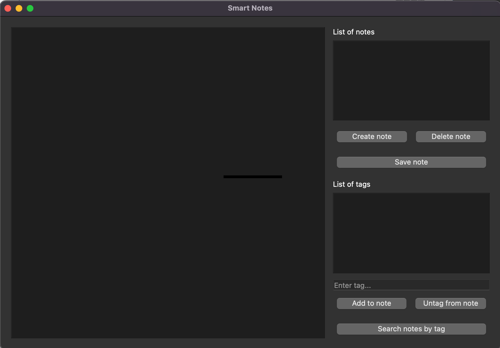

### Task 1. Smart Notes application interface

In the notes_main.py file, describe the Smart Notes application interface. To do this:

1. Import the PyQt5 library and the necessary widgets. If you have any difficulties, look at how it was done in the previous Memory Card project.
2. Create a QApplication object for the application itself. Create an application window.
3. Create the necessary interface elements: input fields, lists, and buttons. Come up with clear names for them.
4. Position all the objects along the guide lines. Apply the resulting layout to the application window.
5. Make the application window visible and run the application.

### Task 2. Json file creation
Arrange the storage of notes in a json file to work with them. To do this:

1. In the notes_main.py file, create a notes dictionary with a note with instructions and write it in the notes_data.json file in json, thereby creating it. If you get lost, use the tip.
2. When starting the application (after the command "make the window visible") read the information from the json file and place it on the widgets.
3. Process clicking on the name of the note in the list. It should be processed using the show_results() function, which will distribute note data—widgets and text—among the widgets.

### Task 3. Editing notes
Program note editing: create new notes, save typed notes, and delete notes from a list. To do this:

1) Create the add_note, del_note, and save_note functions. Remember that you need to make changes not only to the notes list, but also to the notes_data.json file, and widgets with data.
2) Process clicks on the widget-buttons "Create note," "Save note," and "Delete note," using the functions you wrote.

### Task 4. Working with tags
Program note searching by tag. To do this, create the search_note function. Implement branching in the function:

1) If the "Search by tag" button is clicked, notes with this tag should be executed. The result—a dictionary of filtered notes—should appear instead of the full dictionary in list_notes. After the search, the name of the button should change to "Reset Search."
2) If the "Reset Search" button is clicked, the tag input field should be cleared and the full notes dictionary should be displayed again. After resetting the results, the name of the button should change to "Search by tag."

Note. If this task is too difficult, use the tip.

